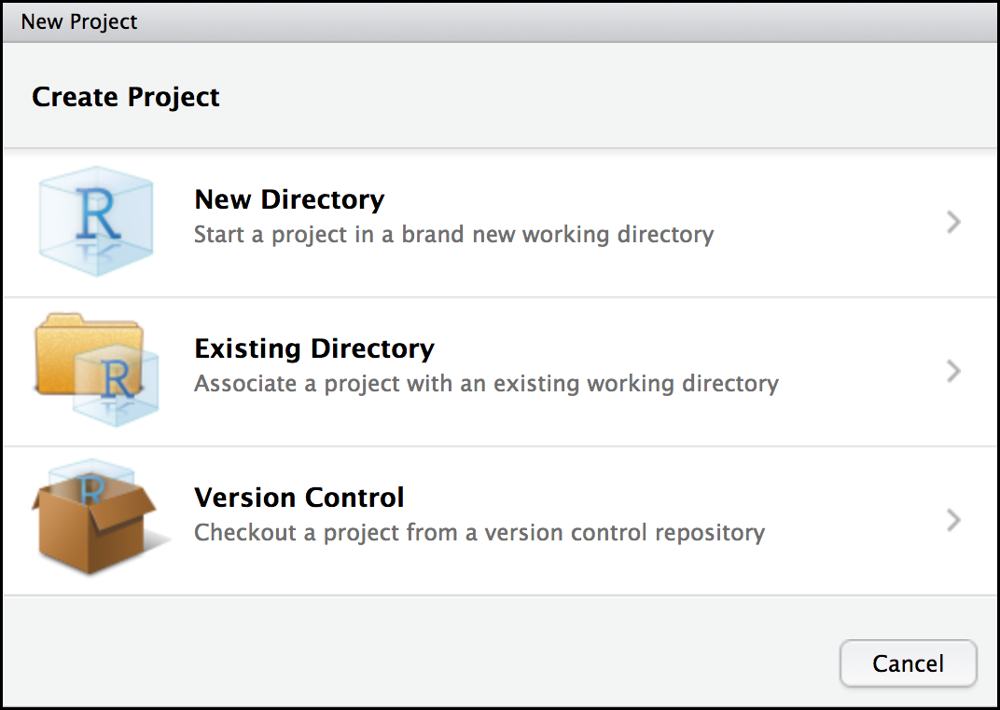

.. include:: cyverse_rst_defined_substitutions.txt

|CyVerse_logo|_

|Home_Icon|_
`Learning Center Home <http://learning.cyverse.org/>`_

R and RStudio basics
-----------------------

.. admonition:: learning-objectives

  - "Create an RStudio project, and know the benefits of working within a
    project"
  - "Be able to customize the RStudio layout"
  - "Be able to locate and change the current working directory with `getwd()`
    and `setwd()`
  - "Compose an R script file containing comments and commands"

Create an RStudio project
~~~~~~~~~~~~~~~~~~~~~~~~~~~

One of the first benefits we will take advantage of in RStudio is something
called an **RStudio Project**. An RStudio project allows you to more easily:

- Save data, files, variables, packages, etc. related to a specific
  analysis project
- Restart work where you left off
- Collaborate, especially if you are using version control such as git

To create a project, go to the :guilabel:`&File` menu, and click :guilabel:`&New Project...`.

  |new_project_window|

In the window that opens select **New Directory**, then **New Project**. For
"Directory name:" enter **r_learning**. For "Create project as subdirectory
of", you may leave the default, which is your home directory "~".

Finally click :guilabel:`&Create Project`. In the "Files" tab of your output
pane (more about the RStudio layout in a moment), you should see an RStudio
project file, **r_tutorial.Rroj**. All RStudio projects end with the
"**.Rproj**" file extension.

Creating your first R script
~~~~~~~~~~~~~~~~~~~~~~~~~~~~~~~~

Now that we are ready to start exploring R, we will want to keep a record of the
commands we are using. To do this we can create an R script:

Click the :guilabel:`&File` menu and select :guilabel:`&New File` and then
:guilabel:`&R Script`. Before we go any further, save your script by clicking
the save/disk icon that is in the bar above the first line in the script editor,
or click the :guilabel:`&File` menu and select :guilabel:`&save`. In the
"Save File" window that opens, name your file **"r_basics"**. The new script
**r_basics.R** should appear under "files" in the output pane. By convention,
R scripts end with the file extension **.R**.

  .. tip::

     A script is simply a file (usually a text file) that contains a set
     of instructions (code) to be run by the computer. We will be writing
     several lines of code and running these lines of code line-by-line
     as we learn. Once you have finished with a script, all the lines of
     code can be run (from top to bottom) automatically.

Overview and customization of the RStudio layout
~~~~~~~~~~~~~~~~~~~~~~~~~~~~~~~~~~~~~~~~~~~~~~~~~~~~~~~

Here are the major windows (or panes) of the RStudio
environment:

|rstudio_session_4pane_layout|

- **Source**: This pane is where you will write/view R scripts. Some outputs
  (such as if you view a dataset using `View()`) will appear as a tab here.
- **Console/Terminal**: This is actually where you see the execution of
  commands. This is the same display you would see if you were using R at the
  command line without RStudio. You can work interactively (i.e. enter R
  commands here), but for the most part we will run a script (or lines in a
  script) in the source pane and watch their execution and output here. The
  "Terminal" tab give you access to the BASH terminal (the Linux operating
  system, unrelated to R).
- **Environment/History**: Here, RStudio will show you what datasets and
  objects (variables) you have created and which are defined in memory.
  You can also see some properties of objects/datasets such as their type
  and dimensions. The "History" tab contains a history of the R commands you've
  executed R.
- **Files/Plots/Packages/Help**: This multipurpose pane will show you the
  contents of directories on your computer. You can also use the "Files" tab to
  navigate and set the working directory. The "Plots" tab will show the output
  of any plots generated. In "Packages" you will see what packages are actively
  loaded, or you can attach installed packages. "Help" will display help files
  for R functions and packages.

.. tip::

  **Uploads and downloads in the cloud**

  In the "Files" tab you can select a file and download it from your cloud
  instance (click the "more" button) to your local computer.
  Uploads are also possible.

All of the panes in RStudio have configuration options. For example, you can
minimize/maximize a pane, or by moving your mouse in the space between
panes you can resize as needed. The most important customization options for
pane layout are in the :guilabel:`&View` menu. Other options such as font sizes,
colors/themes, and more are in the :guilabel:`&Tools` menu
under :guilabel:`&Global Options`.

.. note::

  **You are working with R**

  Although we won't be working with R at the terminal, there are lots of reasons
  to. For example, once you have written an RScript, you can run it at any
  Linux, Mac, or Windows terminal without the need to start up RStudio. We don't
  want you to get confused - RStudio runs R, but R is not RStudio.

Getting to work with R: navigating directories
~~~~~~~~~~~~~~~~~~~~~~~~~~~~~~~~~~~~~~~~~~~~~~~~~~

Now that we have covered the more aesthetic aspects of RStudio, we can get to
work using some commands. We will write, execute, and save the commands we
learn in our **r_basics.R** script that is loaded in the Source pane. First,
let's see what directory we are in. To do so, type the following command
into the script:

  .. code:: R

     getwd()

To execute this command, make sure your cursor is on the same line the command
is written. Then click the :guilabel:`&Run` button that is just above the first
line of your script in the header of the Source pane.

In the console, we expect to see the following output:

  .. code:: R

     [1] "/home/rstudio/r_learning"

Notice, at the Console, you will also see the instruction you executed
above the output in blue.

Since we will be learning several commands, we may already want to keep some
short notes in our script to explain the purpose of the command. Entering a `#`
before any line in an R script turns that line into a comment, which R will
not try to interpret as code. Edit your script to include a comment on the
purpose of commands you are learning, e.g.:

  .. code:: R

    # this command shows the current working directory
    getwd()

.. admonition:: Question

   What happens when you try to enter the `getwd()` command in the Console pane?

   .. admonition:: Answer

      You will get the same output you did as when you ran `getwd()` from the
      source. You can run any command in the Console, however, executing it from
      the source script will make it easier for us to record what we have done,
      and ultimately run an entire script, instead of entering commands one-by-one.

For the purposes of this exercise we want you to be in the directory
`"/home/rstudio/r_learning"`.

What if you weren't? You can set your home directory using the `setwd()`
command. Enter this command in your script, but *don't run* this yet.

  .. code:: R

    # This sets the working directory
    setwd()

You may have guessed, you need to tell the `setwd()` command
what directory you want to set as your working directory. To do so, inside of
the parentheses, open a set of quotes. Inside the quotes enter a `/` which is
the root directory for Linux. Next, use the :guilabel:`&Tab` key, to take
advantage of RStudio's Tab-autocompletion method, to select `home`, `rstudio`,
and `r-learning` directory. The path in your script should look like this:

  .. code:: R

    # This sets the working directory
    setwd("/home/rstudio/r_learning")

When you run this command, the console repeats the command, but gives you no
output. Instead, you see the blank R prompt: `>`. Congratulations! Although it
seems small, knowing what your working directory is and being able to set your
working directory is the first step to analyzing your data.

 .. tip::

    **Never use `setwd()`**

    Wait, what was the last 2 minutes about? Well, setting your working directory
    is something you need to do, you need to be very careful about using this as
    a step in your script. For example, what if your script is being on a computer
    that has a different directory structure? The top-level path in a Unix file
    system is root `/`, but on Windows it is likely `C:\`. This is one of several
    ways you might cause a script to break because a file path is configured
    differently than your script anticipates. R packages like |here| and |file.path|
    allow you to specify file paths is a way that is more operating system
    independent. See Jenny Bryan's |blog post| for this and other R tips.

----

**Fix or improve this documentation**

- Search for an answer:
  |CyVerse Learning Center|
- Ask us for help:
  click |Intercom| on the lower right-hand side of the page
- Report an issue or submit a change:
  |Github Repo Link|
- Send feedback: `Tutorials@CyVerse.org <Tutorials@CyVerse.org>`_

----

|Home_Icon|_
`Learning Center Home <http://learning.cyverse.org/>`_

.. Comment: Place Images Below This Line
   use :width: to give a desired width for your image
   use :height: to give a desired height for your image
   replace the image name/location and URL if hyperlinked

 .. |Clickable hyperlinked image| image:: ./img/IMAGENAME.png
    :width: 500
    :height: 100
 .. _CyVerse logo: http://learning.cyverse.org/

 .. |Static image| image:: ./img/IMAGENAME.png
    :width: 25
    :height: 25

.. |rstudio_session_4pane_layout| image:: ./img/rstudio_session_4pane_layout.png
    :width: 600

.. Comment: Place URLS Below This Line

   # Use this example to ensure that links open in new tabs, avoiding
   # forcing users to leave the document, and making it easy to update links
   # In a single place in this document

   .. |Substitution| raw:: html # Place this anywhere in the text you want a hyperlink

      <a href="REPLACE_THIS_WITH_URL" target="blank">Replace_with_text</a>

.. |Github Repo Link|  raw:: html

   <a href="https://github.com/CyVerse-learning-materials/240-minute-r-tutorial" target="blank">Github Repo Link</a>

.. |here|  raw:: html

   <a href="https://cran.r-project.org/web/packages/here/index.html" target="blank">here</a>

.. |file.path|  raw:: html

   <a href="https://www.rdocumentation.org/packages/base/versions/3.4.3/topics/file.path" target="blank">file.path</a>

.. |blog post|  raw:: html

   <a href="https://www.tidyverse.org/articles/2017/12/workflow-vs-script/" target="blank">blog post</a>
